# Team Calcium -HOTJAR
#### Hotjar was designed and built with privacy in mind. It helps customers to improve their websites and create better user experience.

## Technologies Used
<ul>
<li>HTML
<li>CSS
<li>Javascript
</ul>

### Index Page
<ul>
<li>Overview of the Hotjar Heatmap.
<li>Hotjar is build for Marketers,Product Managers and UX Designers.Hotjar works out of the box for some popular platforms like LightCMS,Weebly.Traditional analytics helps you analyza traffic data,but number alone can't tell you what users really do on your site-Hotjar will.
</ul>
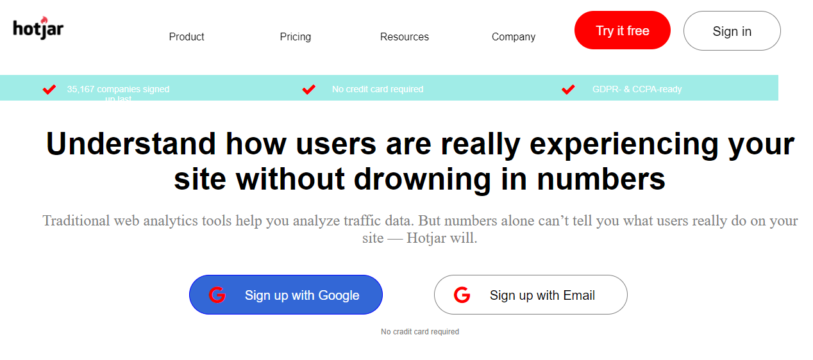
 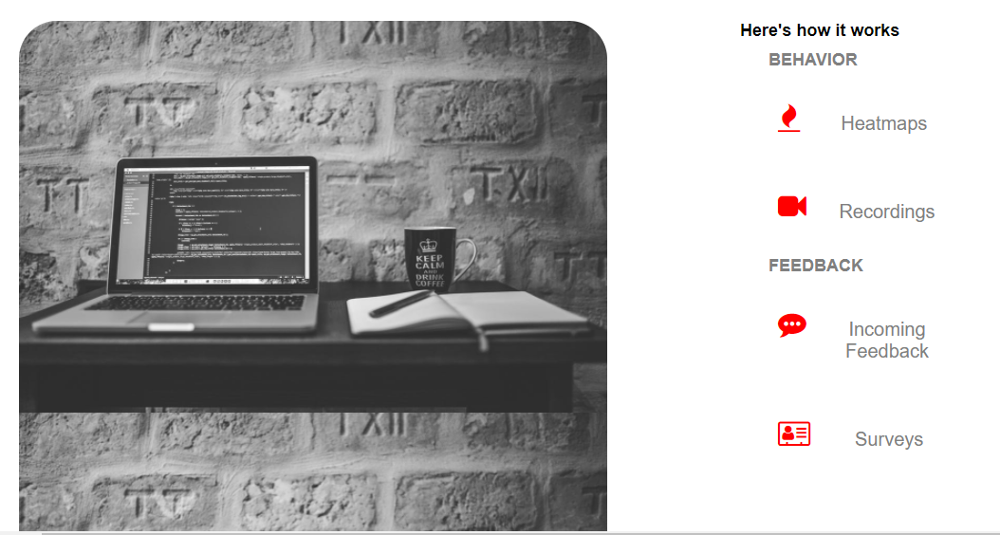
 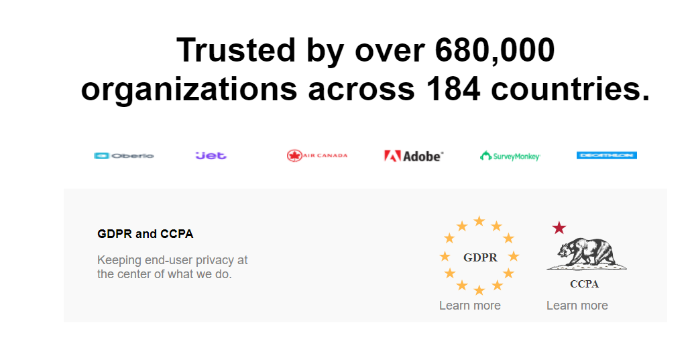
 <h1></h1>

### Pricing page
<ul>
<li>This page will help to know different plans for like Personal,Business,Agency.
<li>In personal there are Basic and Personal subscriptions.In business you have data storage upto 365days and can access upto 2000000Pageviews per day.In agency you can upgrade and download anytime.
</ul>
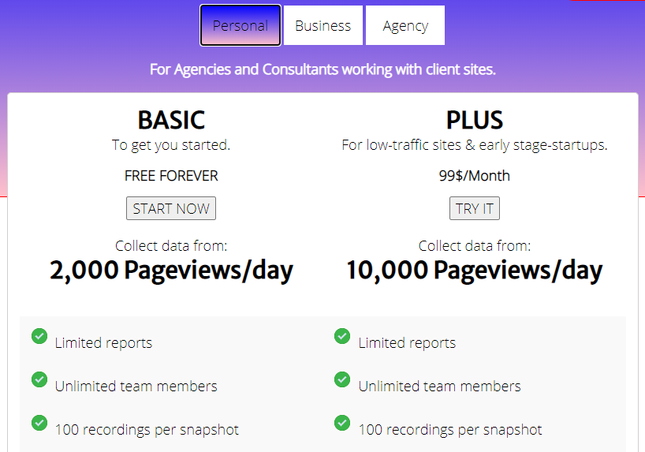
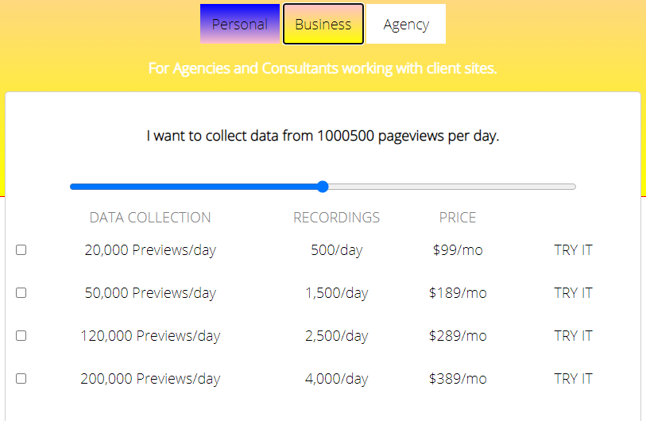
<h1></h1>

### About Us 
<ul>
<li>This page will help to know about Hotjar organization.
<li>Our values and what we do
</ul>
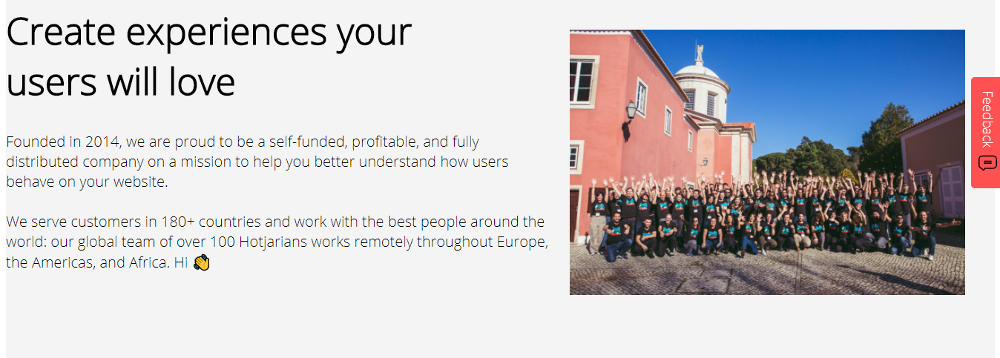
<h1></h1>

### Careers
<ul>
<li>Culture at Hotjar and recruitment process of five stage has been explained.
<li>See open roles on this page
</ul>
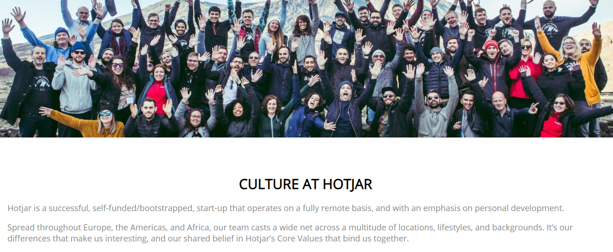
<h1></h1>

### Privacy & Hotjar
<ul>
<li>Hotjar's approach to end user privacy.
<li>Hotjar recors interactions not sensitive data.
</ul>
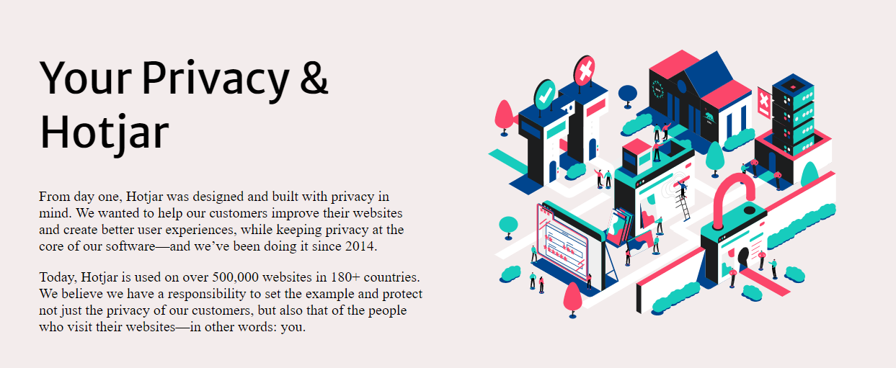
<h1></h1>

### Support Documentation

<ul>
<li>Get help with step by step instructions.Like installing Hotjar,plans and billing,account management,recordings,Compliance,legal &security.
</ul>
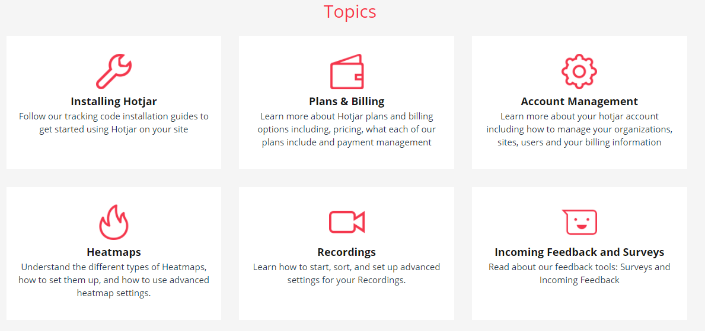
<h1></h1>

# Sign Up & Sign In page
<ul>
<li>The registration page uses for successful login.
</ul>
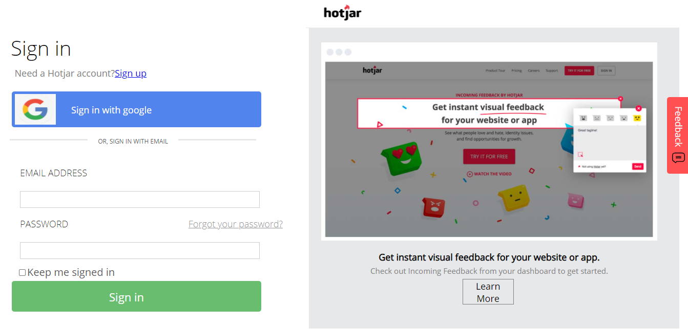
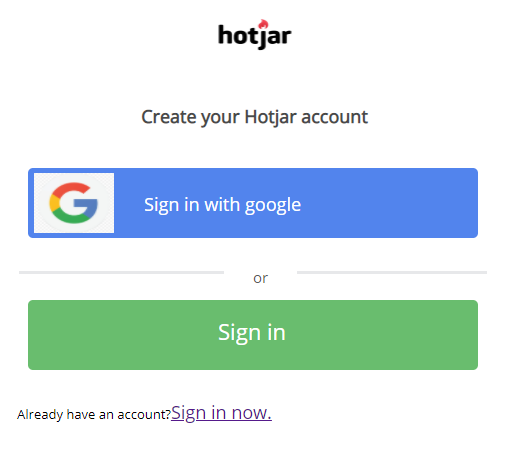

<h1></h1>

 👤 Suchita Salunkhe
 <ul>
 <li>Github : salunkhesuchita
 <li>Email : (salunkhesuchita3@gmail.com)
 </ul>

<h1></h1>

 👤 Vinesh Nair
 <ul>
 <li>Github : Vinesh3124
 <li>Email : (vinesh.nair31@gmail.com)
 </ul>

 <h1></h1>

 👤 Shalendra Singh
 <ul>
 <li>Github : salunkhesuchita
 <li>Email : salunkhesuchita3@gmail.com
 </ul>

